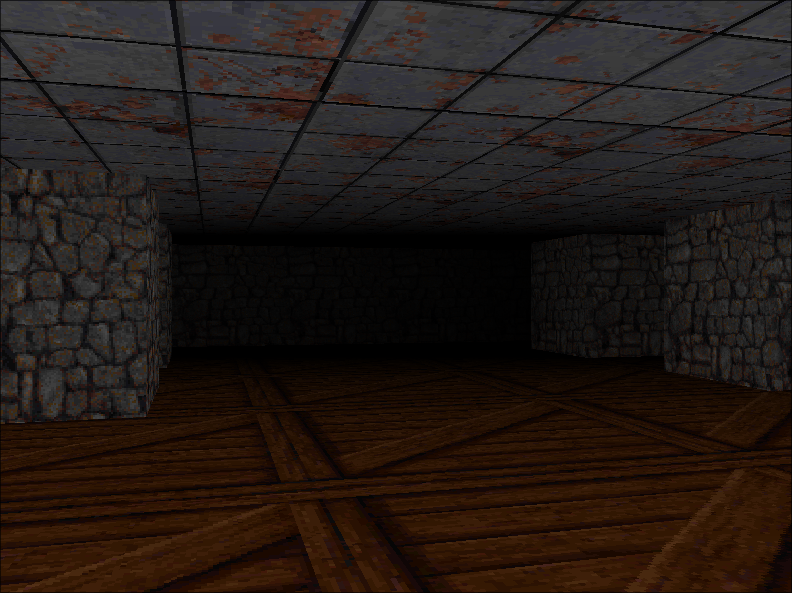

# RayCaster
## Projeto final da disciplina de Programação Orientada a Objetos

Para utilizar o código do projeto, não é necessária a inclusão de nenhuma biblioteca externa.

Tanto as interfaces como o resto de todo o programa foram feitos inteiramente com bibliotecas padrão do java.

Arquivos de dados, imagens e sons são cruciais para o funcionamento correto da aplicação, sem eles o programa não irá
funcionar corretamente e mensagens de erros podem ser exibidas. Dessa forma, 
é importante ressaltar que a estrutura de diretórios e localização de arquivos deve ser preservada de forma a manter a integridade da aplicação.

Além disso, é importante lembrar de ter a versão mais atualizada do Java em seu computador!
